# ROS2humble

✴什么是ros？


- 什么是lambda函数？

  ```
  // 传统方式：单独定义比较函数（代码分散）
  bool compare(int a, int b) { return a > b; }
  std::sort(nums.begin(), nums.end(), compare);
  
  // Lambda 方式：就地定义（逻辑集中）
  std::sort(nums.begin(), nums.end(), [](int a, int b) { return a > b; });
  ```

  

## 一、基础

### 1.节点

#### 1.1介绍

一个节点只负责一个单一的模块化功能（控制车轮转动、雷达数据获取等）

##### 节点间如何交互？

四种方式：

- 话题-topics
- 服务-services
- 动作-Action
- 参数-parameters

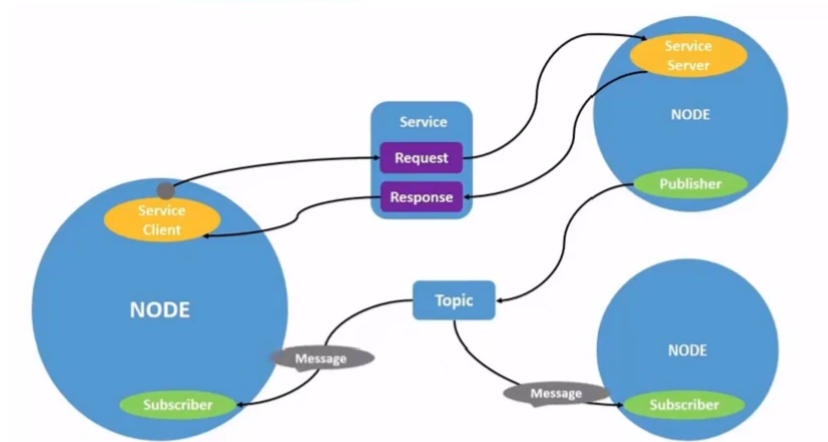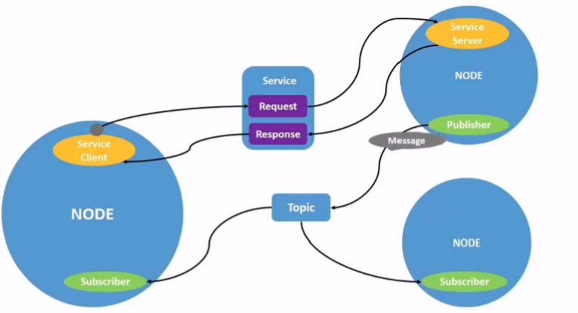

✴上面的是双向，下面的是单向

#### 1.2命令行启动节点

##### 如何启动节点？

`ros2 run <package_name> <executable_name>`

命令行界面：

- CLI：命令行界面，如常见的终端
- GUI:  图形用户界面，可视化

查看节点列表：

`ros2 node list`

查看节点信息：

`ros2 node info <node_name>`

重映射节点名称：

`ros2 run turtlesim turtlesim_node --ros-args --remap __node:=my_turtle`

### 2.工作空间与功能包

#### 2.1介绍

工作空间：包含若干个功能包的目录

`mkdir -p turtle_ws/src`

`cd turtle_ws/src`

功能包：存放节点的地方

类型：

- ament_python:  存放python程序
- cmake:  存放c++程序
- ament_cmake:  适用c++，是cmake增强版

#### 2.2功能包获取

获取方式：

1. 安装获取：

   `sudo apt install ros-<version>-package_name`

2. 手动编译获取：(当作者没有将可执行文件上传仓库时/源码修改)

​		 下载源码->编译生成相关文件->手动source工作空间的install目录

#### 2.3功能包相关指令

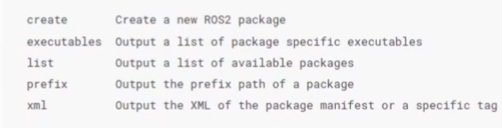

1. 创建功能包

   `ros2 pkg create <package-name> --build-type {cmake,ament_cmake,ament_python} --dependencies <依赖名字>`

2. 列出可执行文件

   `ros2 pkg executables` 所有文件

   `ros2 pkg executables turtlesim` 某个功能包的

3. 列出所有的包

   `ros2 pkg list`

4. 输出某个包所在路径的前缀

   `ros2 pkg prefix <package-name>`

5. 列出包的清单的描述文件

   `ros2 pkg xml turtlesim`

​	->安装依赖，确定编译顺序等

### 3.colcon编译工具

#### 3.1介绍

它是一种功能包构建工具，简单说就是编译代码的

#### 3.2克隆功能包并编译

1. 创建一个工作区文件夹并跳转`colcon.test/src`

2. 从github上下载一个ros2实例源码

   「速度慢是网站污染，用代理可提速」

3. 编译工程`colcon build`

「过程中产生build/install/log,分别是编译产生文件，安装文件和日志」

   4.运行自己编的节点

​	->source一下setup.bash，让上下本知道功能包存在

​	->运行一个订杂志节点

​	->在打开一个终端，source,运行	

#### 3.3常用指令

1. 只编译一个包

   `colcon test --packages-select YOUR_PKG_NAME`

2. 不编译测试单元

   `colcon test --packages-select YOUR_PKG_NAME --cmake-args -DBUILD_TESTING`

3. 运行编译包测试

   `colcon test`

4. 允许更改src下部分文件来改变install

​	`colcon build --symlink-install` 「调整python代码后不用重安装」

​	->python本质是解释执行，在复制代码在编译文件下后，更改后编译文件	内不会改变，用本代码把代码直接链接过去，避免重复制

### 4.手撸python节点

#### 4.1创建工作空间和功能包

1. 创建工作空间

   `mkdir -p town_ws/src`

   `cd town_ws/src`

2. 创建功能包

`ros2 pkg create village_li --build-type ament_python --			dependencies rcly`

- --build-type:  编译类型，分为ament_python,ament_cmake,cmake，默认是第二种

​	3.创建python节点

​		在__init_py处创建同级别目录，名为name.py

#### 4.2使用非OOP方法编辑节点

1. 导入库文件

   引用头文件，python为rclpy，c++为rclcpp

2. 初始化客户端

   `rclpy.init(args=args)`

3. 新建节点

   `node=Node("li4")`

   `node.get_logger().info("文本")`#通过获取日志打印

4. spin循环节点

   `rclpy.spin(node)`#保持节点运行

5. 关闭客户端库

   `rclpy.shutdown()`

#### 4.3OOP介绍

三种编程思想：

1. **面向过程编程思想**（POP）

   分析问题解决需要步骤，一步步执行

2. **面向对象编程思想**（OOP）

   

3. **函数式思想**（FP）

->OOP:

- 类与对象：一个抽象类里有的具体对象
- 封装，继承和多态：封装即对象=属性+行为；继承可以减少工作量；多态意为一个抽象类里可以有的不同类型

```
class WriteNode(Node):

​	def __init__(self,name);

​			super().__init__(name)`

​			`self.get_logger().info("helloworld%s.,%name);					
```

### ->以上c++写法：

### 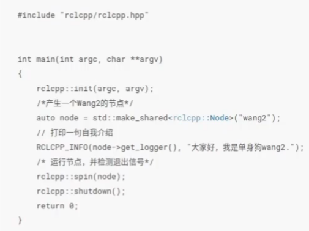

- `std::make_shared<class>()` 是 C++ 的智能指针写法，自动管理内存。

###### 什么是Anaconda?

Anaconda 的主要功能和优势
集成环境管理
可以轻松创建、管理不同的 Python 虚拟环境，避免包版本冲突。
例如，你可以为不同项目分别建不同环境，各环境有不同Python版本和包。

丰富的预装科学计算包
Anaconda 自带了大量常用的科学计算库，比如 NumPy、Pandas、Matplotlib、Scikit-learn、TensorFlow、PyTorch 等，无需单独安装。

包管理器 conda
除了 Python 自带的 pip，Anaconda 自带 conda 包管理工具，它支持安装不仅是 Python 包，还有 C/C++ 库等，且依赖管理更全面。

跨平台兼容性好
Windows、Linux、MacOS 都支持，适合做跨平台开发和研究。

但是 Anaconda 也有一些注意点

可能与系统的 Python 环境冲突，尤其是开发涉及系统级依赖的软件时（比如 ROS、嵌入式开发等），需要注意隔离或切换。

有时候系统脚本会误用 Anaconda 的 Python 路径，导致缺少某些包（比如你现在遇到的 catkin_pkg 缺失问题）。

###### Ros2和Anaconda的python冲突？

因为两种Python解释器版本号不同

做法：

` nano ~/.bashrc`#保存退出

`source ~/.bashrc
which python3`#显示系统python

`$HOME/anaconda3/bin/conda init bash`

->这样在`conda activate`里用anaconda的，`conda deactivate`里用系统的版本号

###### 更改命名后编译失败？

缓存日志没有清理干净

 `rm -rf build/ install/ log/`

###### cmake.txt文件出错？

`add_executable(wang2_node src/wang2.cpp)`

`ament_target_dependencies(wang2_node rclcpp)`

`\#让wang2.cpp文件可以被编译成可执行文件`

`install(TARGETS` 

  `wang2_node`

  `DESTINATION lib/${PROJECT_NAME}`

`)`

`\#安装wang2_node可执行文件到lib/village_wang目录下`

->前后那个target和编译成的文件名字一定要一致

## cmakelists.txt

```
cmake_minimum_required(VERSION 3.8)
project(my_ros2_package)

# 默认使用 C++17 标准（推荐 ROS 2 使用 C++14 或 C++17）
if(NOT CMAKE_CXX_STANDARD)
  set(CMAKE_CXX_STANDARD 17)
endif()
set(CMAKE_CXX_STANDARD_REQUIRED ON)

# 查找 ROS 2 的构建系统（ament / colcon）
find_package(ament_cmake REQUIRED)

# ======================
# 如果你有 ROS 2 节点（即包含 C++ 源代码，要编译成可执行文件）
# ======================

# 找到 roscpp 或其他需要的 ROS 2 包，比如 rclcpp
find_package(rclcpp REQUIRED)
# 如果你用到其他功能包，比如 sensor_msgs, geometry_msgs，也在这里 find_package
find_package(geometry_msgs REQUIRED)

# ======================
# 添加可执行文件（你的 C++ 节点程序）
# ======================

# 语法：
# add_executable(<可执行文件名> src/<源代码文件>.cpp)
# target_link_libraries(<可执行文件名> PRIVATE <依赖项...>)
add_executable(my_first_node src/my_first_node.cpp)

# 将 rclcpp 和其他依赖库链接到你的节点
target_link_libraries(my_first_node
  PRIVATE
  rclcpp
  geometry_msgs::geometry_msgs
)

# ======================
# 声明这个可执行文件是一个 ROS 2 组件（可选，如果你要做 component）
# 或者安装这个可执行文件到 ROS 2 环境
# ======================

# 将可执行文件安装到 ROS 2 的 bin 目录下，这样 colcon build 后可以通过 ros2 run 运行
install(TARGETS
  my_first_node
  DESTINATION lib/${PROJECT_NAME}
)

# ======================
# 安装其他资源（比如 launch 文件、配置文件，可选）
# ======================

# 如果你有 launch 文件，可以这样安装：
# install(DIRECTORY launch/
#   DESTINATION share/${PROJECT_NAME}/launch
# )

# ======================
# 必须：声明这是一个 ament 包
# ======================

ament_package()
```


## 二、ROS2通话机制-话题与服务

### 1.话题（Topic）

#### 1.1话题介绍

Topic通信模型->发布-订阅模型

#### 1.2相关工具

##### RqtGraph工具查看话题

- `ros2 run demo_nodes_py listener`
- `ros2 run demo_nodes_cpp talker`
- `rqt_graph`

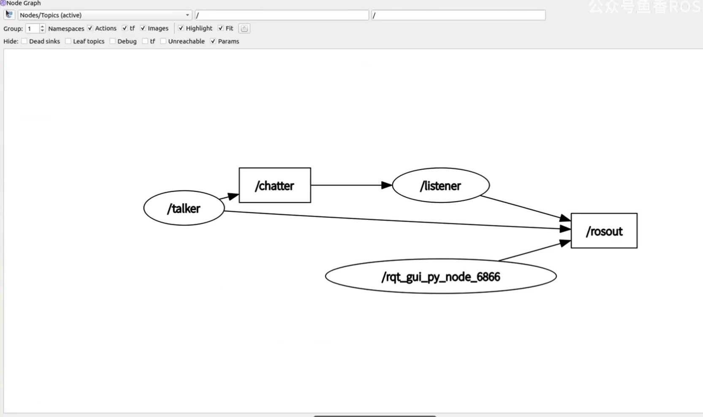

用来看数据是怎么走的

##### CLI工具

->查看命令种类：`ros2 topic -h`

常用的：

- 返回系统当前所有主题列表：

  `ros2 topic list`

- 增加信息类型：

  `ros2 topic list -t`

- 打印实时话题内容：

  `ros2 topic echo /chatter`

- 查看主题信息：

  `ros2 topic info /chatter`

- 查看消息类型：(可以看String里面有什么)

  `ros2 interface show <如std_msgs/msg/String>`

- 手动发布命令：

  `ros2 topic pub /chatter <std_msgs/msg/String> "{<text>}"`

#### 1.3编写cpp发布者

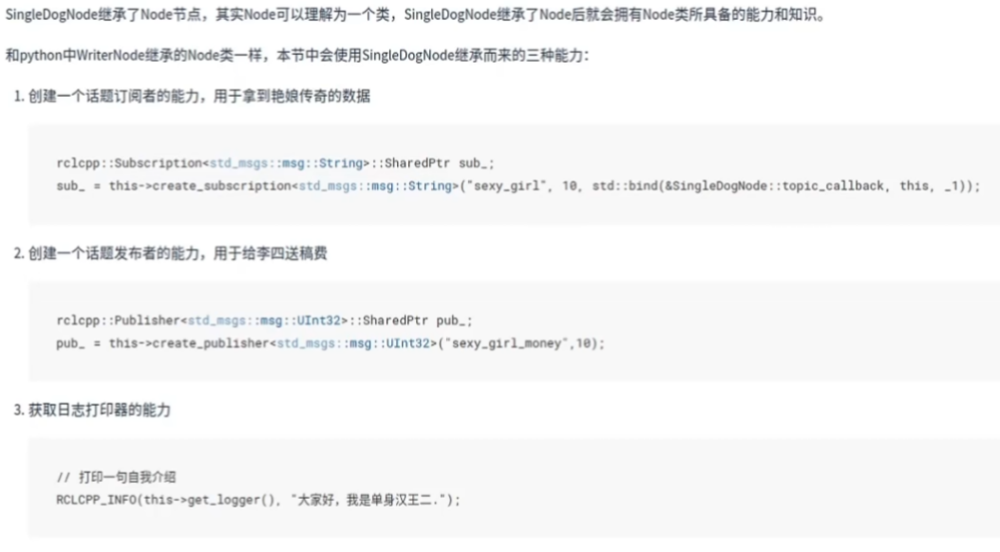

代码实现：

1. 导入订阅的话题接口类型
2. 创建订阅回调函数
3. 声明并创建订阅者
4. 编写订阅回调处理函数

✴话题订阅发布接口类型要一致

->std::bind()：生成回调函数时因为类里的函数必须用一个实例化对象调用，此函数可避免

实例：

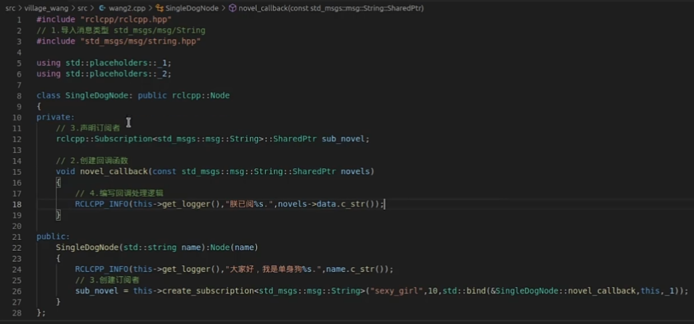

###### ✴ROS 2的异步通信机制

ROS 2采用发布 - 订阅（Publish - Subscribe）等异步通信模式。当你通过create_subscription创建一个订阅者时，ROS 2内部会负责管理消息的接收和分发。当有与订阅主题匹配的消息发布到系统中时，ROS 2的中间件（Middleware，如DDS等）会自动将这些消息传递给相应的订阅者，并触发对应的回调函数执行。

###### ✴回调函数的触发时机

在给定的代码中：

`sub_novel = this->create_subscription<std_msgs::msg::String>("sexy girl", 10, std::bind(&SingleDogNode::novel_callback, this, _1));`
上创建了一个订阅者sub_novel，监听名为"sexy girl"的主题，队列大小为10，并将SingleDogNode类中的novel_callback函数绑定到该订阅者上。当有其他节点向"sexy girl"主题发布`std_msgs::msg::String`类型的消息时，ROS 2会自动调用novel_callback函数，并将接收到的消息指针作为参数传递进去，而不需要开发者在主函数或其他地方手动调用它。

###### ✴中间怎么那么多冒号？	

​	类和函数嵌套

###### ✴话题前加一个‘/’？	

`"/object_center"` 就是一个全局话题，任何节点只要知道这个名称，就可以订阅该话题获取 `geometry_msgs::msg::Point` 类型的消息，或者发布消息到这个话题上。

与之相对的是相对命名空间，即不以 `/` 开头的话题名称。相对话题名称的作用域取决于当前节点的命名空间设置。比如，如果一个节点在名为 `my_robot` 的命名空间下运行，并且它尝试订阅名为 `object_center` 的话题（没有斜杠开头），那么实际上它订阅的是 `my_robot/object_center` 这个全局话题。

#### 1.4编写cpp订阅者

`pub_=this->create_publisher<std_msgs::msg::UInt32>("sexy_girl_money",10)`

- 在ROS 2中创建一个发布者（Publisher），用于向主题 `"sexy_girl_money"` 发布 `std_msgs::msg::UInt32` 类型的消息，队列大小为10。

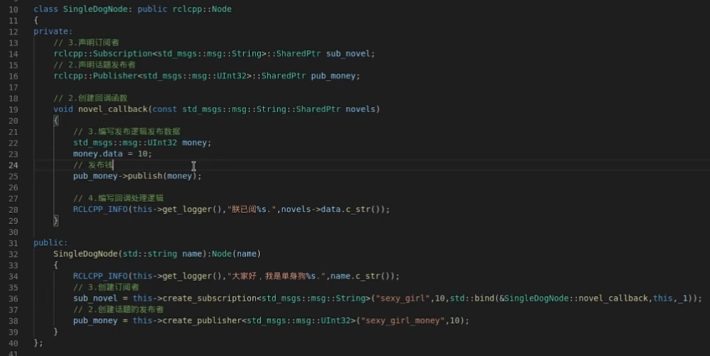

#### 1.5接口介绍

不同变成语言对数据类型定义不同，接口用于抹平这种差异

例：Ros2中雷达统一接口`sensor_msgs/msg/LaserScan`

四种通话方式对应不同接口：

- 话题——`xxx.msg`
- 服务——`xxx.srv`
- 动作——`xxx.action`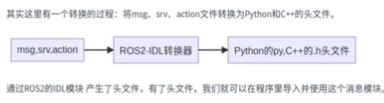

#### 1.6接口相关的CLI

1. 查看接口列表

   `ros2 interface list`

2. 查看所有接口包

   `ros2 interface packages`

3. 查看某个包下的所有接口

   `ros2 interface package std_msgs`

4. 查看某一接口的详细内容

   `ros2 interface show std_msgs/msg/string`

​	5.输出某一接口的属性

​		`ros2 interface proto sensor_msgs/msg/Image`  #ros自带

#### 1.7编写msg接口文件

使用自定义接口需要创建.msg包

步骤：

1. 新建工作空间和功能包
2. 新建msg文件夹和Novel.msg(小说消息)
3. 编写Novel.msg消息

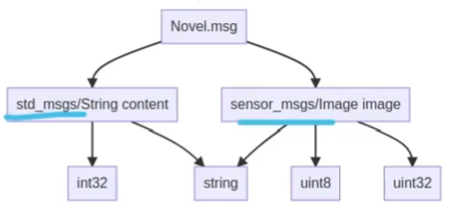

#### 1.8编译接口功能包

->修改CMakeLists.txt

#添加对sensor_msgs的

`find_package(sensor_msgs REQUIRED)`

`find_package(rosidl_default_generators REQUIRED)`

#添加信息文件和依赖

`rosild_generate_interfaces($(PROJECT_NAME))`

​	`“msg/Novel.msg”`

​	`DEPENDENCIES sensor_msgs`

  `)`

✴Novel内容由content数据和images共同组成

### 2.服务（Service）

#### 2.1服务介绍

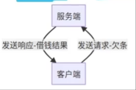

- 客户端发送请求，服务端响应请求
- 同一个服务有且只有一个节点来提供
- 同一个服务可以被多个客户端使用

实例：

1. **启用服务端(节点)**

`ros2 run examples_rclpy_minimal_service service`

2. **手动调用服务**

 `ros2 service list`  #查看服务列表

 `ros2 service call /add_two_ints example_initerfaces/srv/AddTwoInits "(a: 5,b: 10)"`

#### 2.2创建自定义服务接口

步骤：

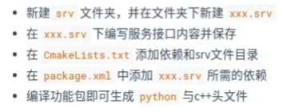

2.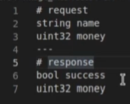  3.`rosild_generate_interfaces($(PROJECT_NAME))`下面加一句

​	`“srv/BorrowMoney.srv”`

#### 2.3编写服务端

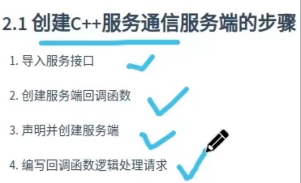

- 先添加依赖：

1. 在package.xml里添加`<depend>village_interface</depend>`

2. 在CMakeLists.txt里添加接口

   `find_package(village_interfaces REQUIRED)`

   add_executable里添加`village_interfaces`

##### 什么是死锁和多线程？

- 死锁：在服务回调函数中等待队列满足需求，好进行服务，因此阻塞，但满足需求的操作在其他回调里，就锁住了
- 多线程：ros2默认单线程，会造成必须等到回调函数结束的结果，为了解决，可以单开一个线程处理，解决死锁

声明一个服务回调组：

`rclcpp::CallbackGroup::SharedPtr callback_group_service_;`

创建多线程(主函数中)：

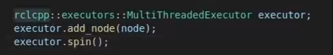

写完SellNovel回调后声明服务端：

`rclcpp::Service<village_interfaces::srv::SellNovel>::SharedPtr sell_server`

再在Public权限下的SingleDogNode中实例化服务端：

`sell_server=this>create_service<village_interfaces::srv::SellNovel("sell_novel",std::bind(&SingleDogNode::sell_novel_callback,this,_1_2),rmw_qos_profile_services_default,sell_novels_callback_group);`

同时创建回调函数组：

`sell_novels_callback_group=this->create_callback_group(rclcpp::CallbackGroupType::MutuallyExclusive)`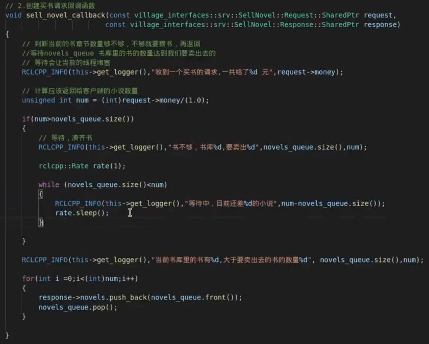

延时函数：

`rclcpp::Rate rate(time)`

`rate.sleep()`

#### 2.4编写客户端

步骤：

1. 导入服务接口
2. 创建请求结果接收回调函数
3. 声明并创建客户端
4. 编写结果接受逻辑
5. 调用客户端发送请求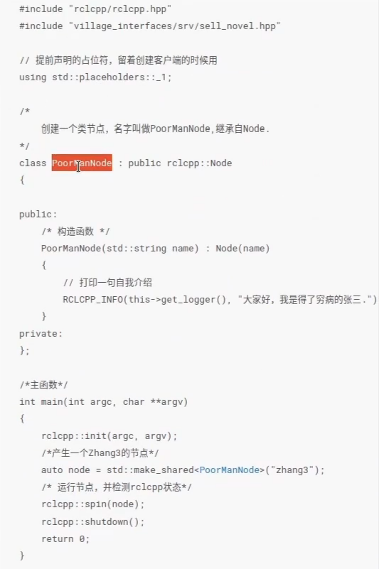

###### ✴占位符的作用：

**占位符 `_1`, `_2`** 是为了延迟函数参数的传递，

编写逻辑后：


->打印部分为：nobel.c_str()

###### ✴什么是std::bind？

bind函数又称回旋函数，没有它回调函数不能被执行

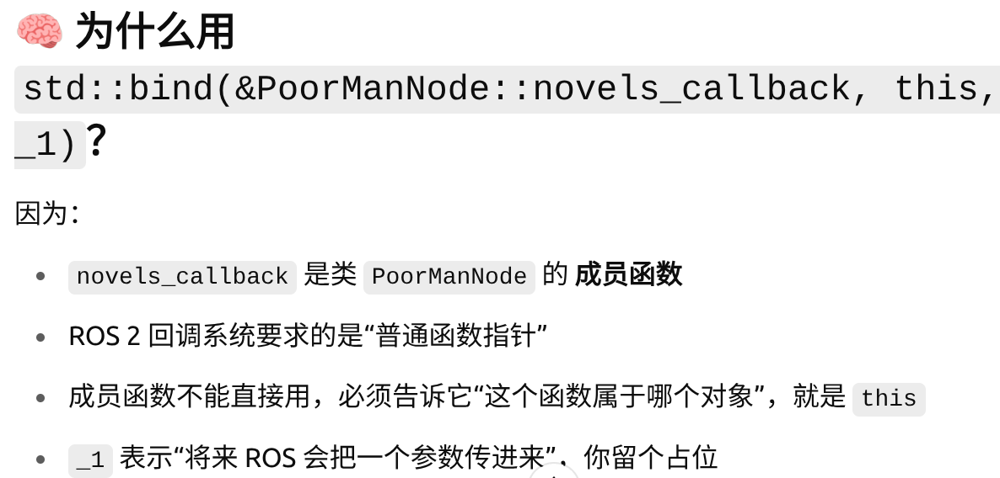

在 C++ 中，**每个对象在调用成员函数时，系统会自动传入一个指针，叫 `this`**，它指向当前正在使用这个函数的那个对象。

## 三、ROS2通信机制-参数与动作

### 1.参数介绍

**参数是节点的一个配置值，可以认为任务参数是一个节点的设置**

#### 1.1组成成分

键值对，对应名字和数值

#### 1.2命令

- **查看参数**：

  `ros2 param list`

- **查看参数信息**：

  `ros2 param describe <node_name> <param_name>`

- **设置节点**：

  `ros2 param set <node_name> <param_name> <value>`

- **储存参数**：

  `ros2 param dump <node_name>`

- **打开后将参数值修改为储存的**：

  `ros2 param loadc <node_name> <file_name>`

- **打开时就修改参数为储存的**：

​		`ros2 run <package_name> <executable_name> --ros-args --params-file <file_name>`

### 2.参数修改

### 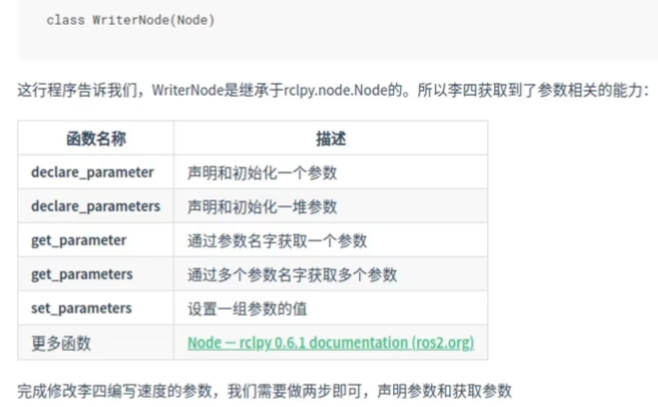

步骤：

1. 声明参数

   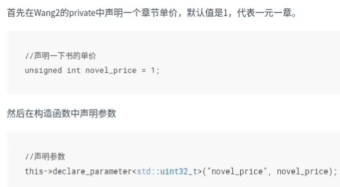

   uint32_t为不支持的参数类型，应改为int64_t

2. 获取并设置参数

   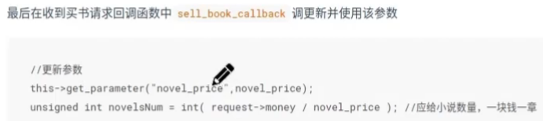

###### ✴`rqt`工具可以任意修改值

### 3.动作介绍

动作通信主要解决以下问题：

- 不能确认服务端接收并处理目标
- 任务进度没有反馈
- 任务一半不能重新修改

#### 3.1组成成分

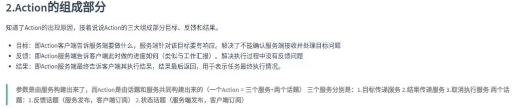

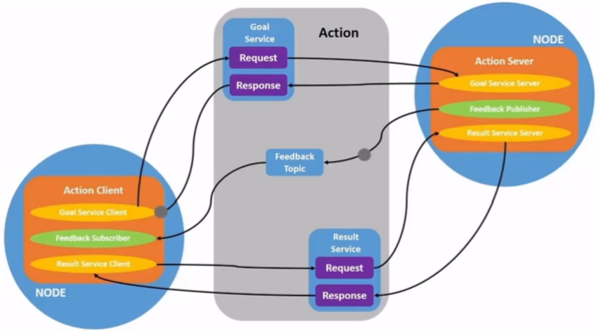

#### 3.2CLI工具

- **查看action列表**

  `ros2 action list`

  同时查看action类型

  `ros2 action list -t`

- **发送请求到服务端**

  `ros2 action send_goal <service_name> <service_type> "{theta:xx}"`

  根据goal的定义，形式为theta(yaml格式)

​		若要求反馈，在以上命令后添加`-feedback`

### 4.实现

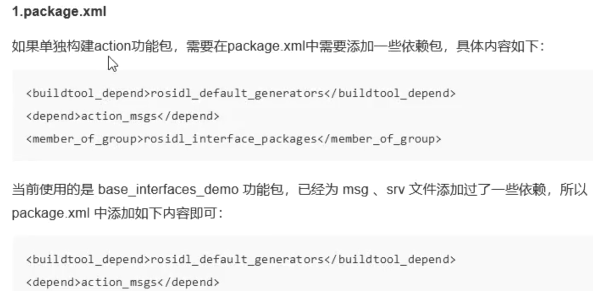

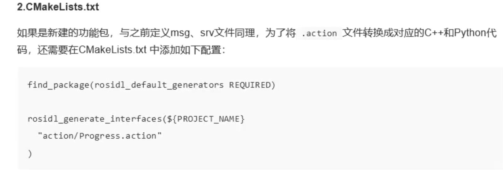

接口生成在工作空间的install文件夹

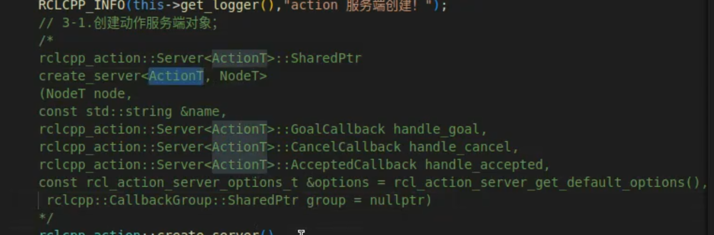

还要改一坨，具体要熟悉cmakelists.txt的原理

- 自定义接口：

  - .txt

    ```
    find_package(rosidl_default_generators REQUIRED)
    
    find_package(rosidl_default_runtime REQUIRED)
    
    find_package(action_msgs REQUIRED)
    
    
    
    \# Generate interfaces
    
    rosidl_generate_interfaces(${PROJECT_NAME}
    
      "action/Progress.action"
    
    )
    ```

    

  - .xml

    ```
      <!--编译工具依赖项-->
      <buildtool_depend>ament_cmake</buildtool_depend>
      <buildtool_depend>rosidl_default_generators</buildtool_depend>
    
      <depend>rclcpp</depend>
      <depend>action_msgs</depend>
    
      <!--编译过程中的添加依赖-->
      <build_depend>rosidl_default_generators</build_depend>
      <exec_depend>rosidl_default_runtime</exec_depend>
      <test_depend>ament_lint_auto</test_depend>
      <test_depend>ament_lint_common</test_depend>
    
      <!--声明功能包-->
    
      <member_of_group>rosidl_interface_packages</member_of_group>
    
    ```

    

- 创建端点：

  - .txt

    ```
    find_package(rclcpp_action REQUIRED)
    find_package(base_interfaces REQUIRED)  # 你定义了 Progress.action 的接口包
    # 创建可执行文件
    add_executable(action_server src/serverce.cpp)
    
    # 链接依赖
    ament_target_dependencies(action_server
      rclcpp
      rclcpp_action
      base_interfaces  # 你定义了 Progress.action 的接口包
    )
    
    # 安装节点
    install(TARGETS
      action_server
      DESTINATION lib/${PROJECT_NAME}
    )
    ```

    

  - .xml

    ```
      <buildtool_depend>ament_cmake</buildtool_depend>
      <buildtool_depend>rosidl_default_generators</buildtool_depend>
    
      <depend>rclcpp</depend>
      <depend>rclcpp_action</depend>
      <depend>base_interfaces</depend>
      <depend>action_msgs</depend>
    
      <member_of_group>rosidl_interface_packages</member_of_group>
    
      <test_depend>ament_lint_auto</test_depend>
      <test_depend>ament_lint_common</test_depend>
    
    ```

  ！！不能直接全复制粘贴

手动向服务端发送信息

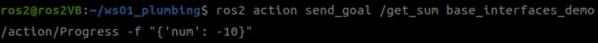

## 四、ROS2节点管理-常用工具

### 1.编写Launch文件

#### 1.1三种格式

python,yaml,xml，用python更加灵活

#### 1.2开始编写

编写launch文件创建文件时在功能包目录下创建，与src同目录

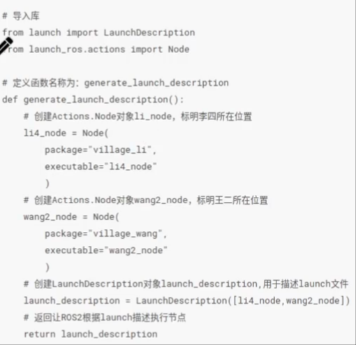

在两个节点下的CmakeLists.txt修改添加

`install(DIRECTORY launch`

​	`DESTINATION share/$(PROJECT_NAME))`

->编译后source一下，再运行这个launch文件，这样两个节点就可以一起跑不用开多个终端

！！

```
add_executable(action_server src/serverce.cpp)

ament_target_dependencies(action_server

  rclcpp

  rclcpp_action

  base_interfaces

)

\# 分别添加依赖

add_executable(action_client src/client.cpp)

ament_target_dependencies(action_client

  rclcpp

  rclcpp_action

  base_interfaces

)
```


#### 1.3修改参数

#### 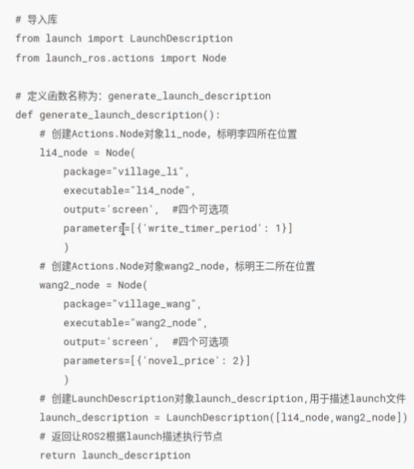

**->修改命名空间**：

结点下添加*`namespace="xx"`*

#### 1.4文件修改

- .xml：

  ```
  <exec_depend>launch</exec_depend>
  
    <exec_depend>launch_ros</exec_depend>
  ```

- launch文件目录：

  工作空间/install/包名/share/包名/launch/my_launch.py

- 命令：

  ros2 lunch packages_name my_launch.py

### 2.ROS2bags

**用于记录话题数据并转为文件**

#### 2.1命令

- 记录话题数据

  `ros2 bag record <topic_name>`

- 记录多个话题数据

  `ros2 bag record <topic1_name> <topic2_name>`

- 记录所有话题

  `ros2 bag record -a`

- 自定义输出文件名字

  `ros2 bag record -o file-name topic-name`

#### 2.2播放数据

- 播放数据

  `ros2 bag play xxx.db3`

- 查看数据

  `ros2 topic echo /sexy_girl`

- 倍速播放

  `ros2 bag play xxx.db3 -r 10`  #十倍速

- 循环播放

  `ros2 bag play xxx.db3 -l` 

- 单话题播放

  `ros2 bag play xxx.db3 --topics <topic_name>` 

### 3.RQT工具

**RQT是一个GUI工具，通过插件方式实现各种工具**

`rqt`

- node graph：图像化查看节点，话题相关关系

- process monitor：查看相关进程，节点等

  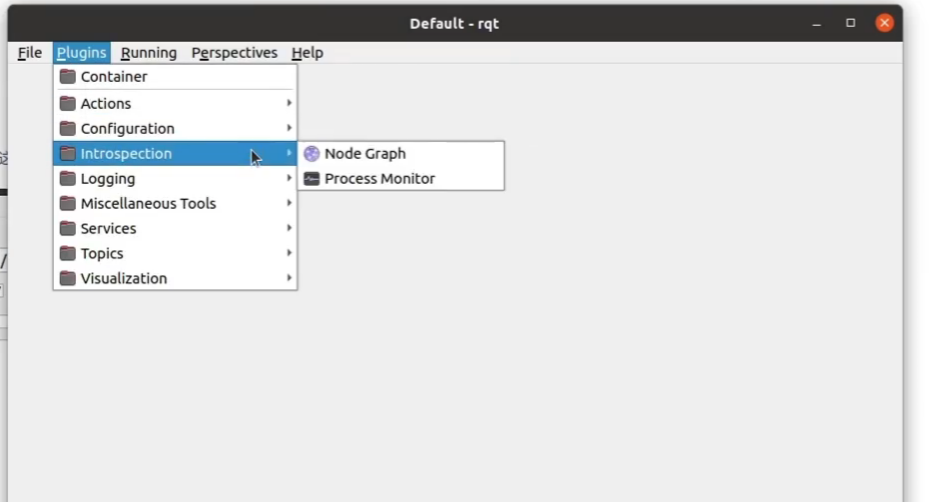

- topic相关：发布消息

  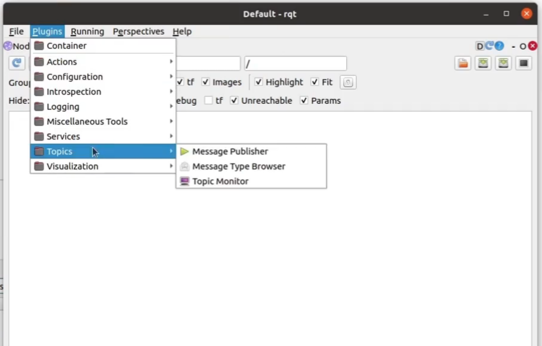

- logging相关：对日志进行过滤和选择

  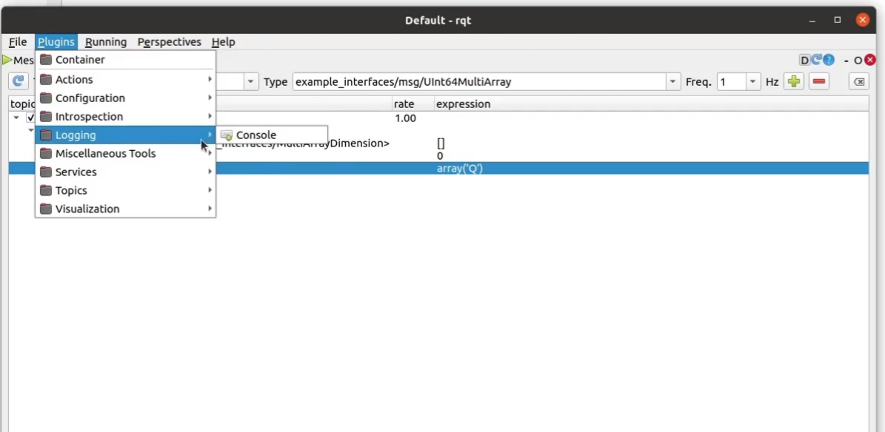

- severce相关：调用服务，停止服务

  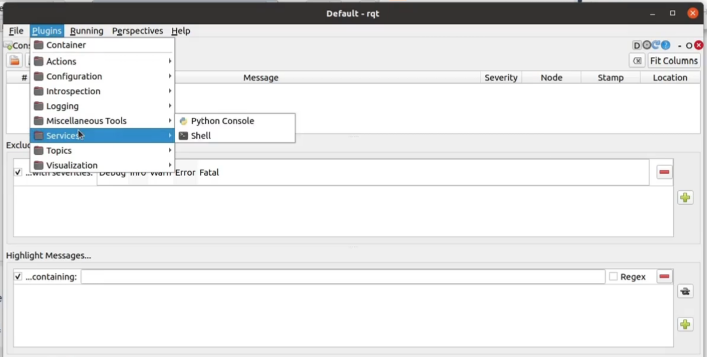

- topic相关：查看话题与启动话题

  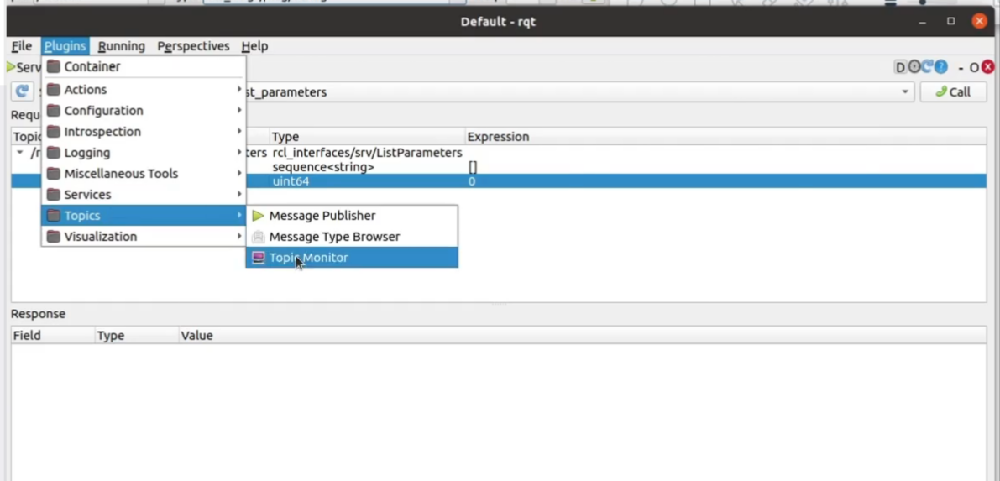

- 可视化工具：查看图片数据和画图

  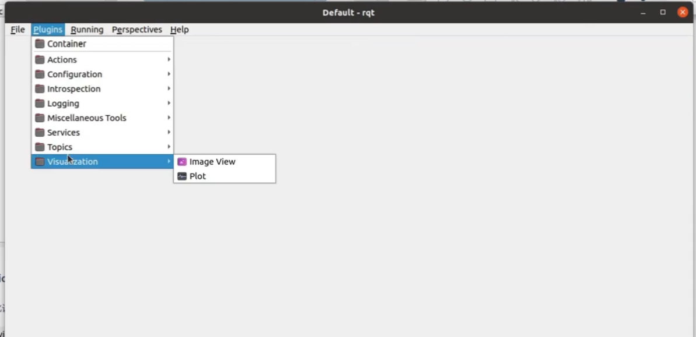

### 4.RVIZ2工具

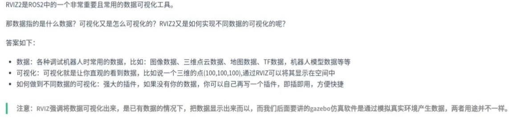

### 5.仿真工具Gazebo

**通过虚拟环境生产数据**

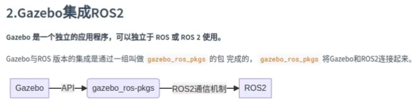

- 安装教程

https://blog.csdn.net/qq_38880380/article/details/145044996

## 五、分布式

### 1.场景及概念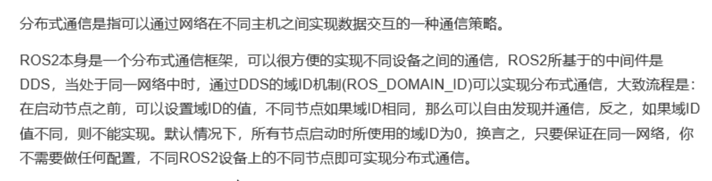

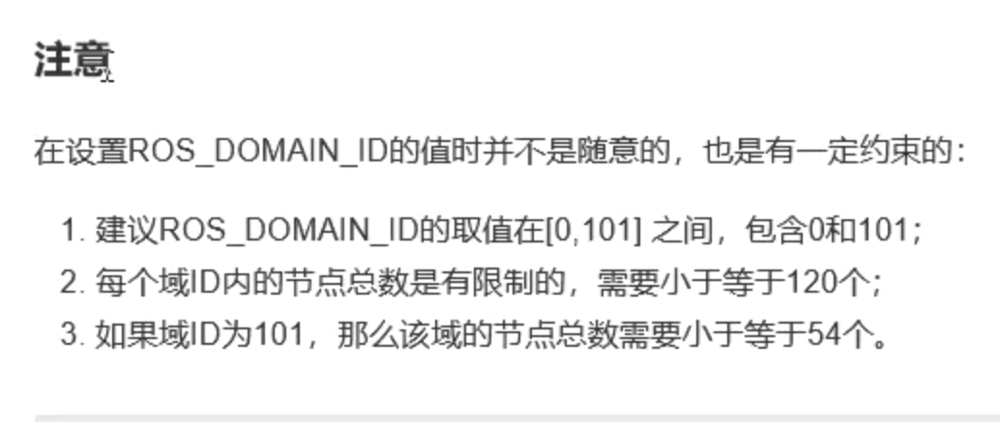

### 2.域ID计算规则

`export ROS_DOMAIN_ID=x`

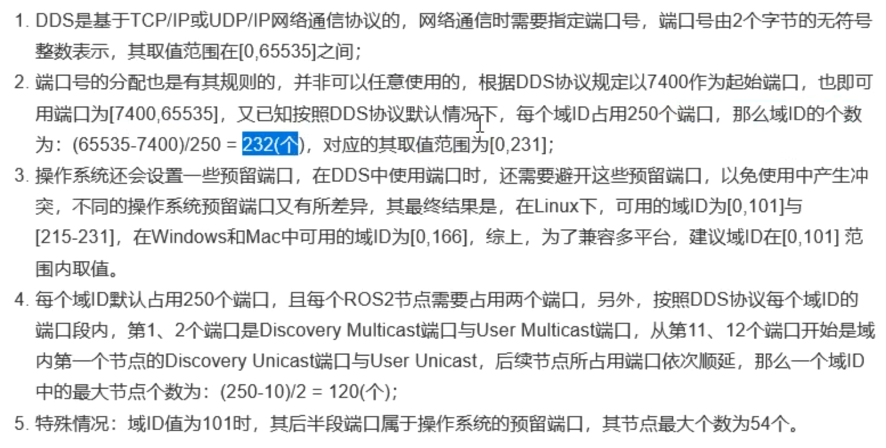

## 六、机器人运动

头文件：

twist信息：

linear.x  - 前进/后退速度 (m/s)
linear.y  - 左右平移速度 (m/s)
linear.z  - 上下移动速度 (m/s)
angular.x - 绕x轴旋转速度 (roll, rad/s)
angular.y - 绕y轴旋转速度 (pitch, rad/s)
angular.z - 绕z轴旋转速度 (yaw, rad/s)

## 七、激光雷达


std_msgs/Header header
float32 angle_min        # 起始角度(弧度)
float32 angle_max        # 结束角度(弧度)
float32 angle_increment  # 角度增量(弧度)
float32 time_increment   # 每束激光间的时间增量(秒)
float32 scan_time        # 扫描时间(秒)
float32 range_min        # 最小有效距离(米)
float32 range_max        # 最大有效距离(米)
float32[] ranges         # 距离数据(米)
float32[] intensities    # 强度数据(可选)

##### 什么是QoS

QoS（Quality of Service）即服务质量。在有限的带宽资源下，QoS为各种业务分配带宽，为业务提供端到端的服务质量保证。例如，语音、视频和重要的数据应用在网络设备中可以通过配置QoS优先得到服务。

##### pip install和sudo install的区别？

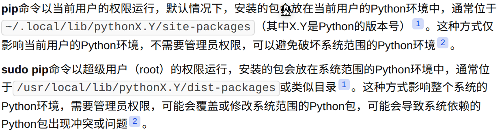

## 附加

乱搞之后有时候需要重建功能包：

```
cd ~/yolo_tried
rm -rf build/install/log/
colcon build
```

跑cmake的有时候会忘了怎么跑：

```
cd /home/wybie/yolo_tried
mkdir -p build && cd build

cmake ..

make

ls -l sunnet
```

存在就可以跑了
